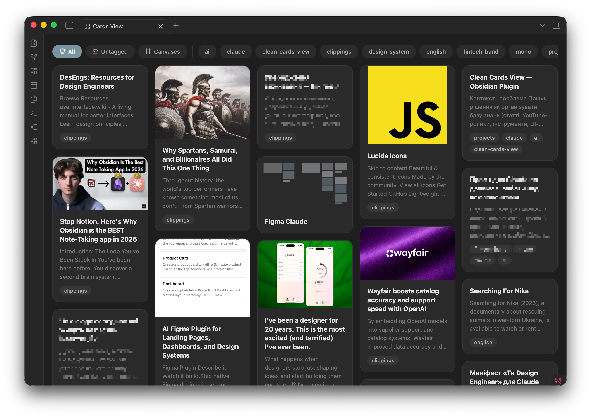

# Clean Cards View

Display your vault notes as clean, minimal cards with cover images, text preview, tags and filtering.



## Features

- **Card layout** — notes displayed as masonry cards that adapt to window width
- **Cover images** — automatically extracted from frontmatter (`cover`, `image`, `banner`), first image in note body, or YouTube thumbnails
- **Text preview** — first ~160 characters of note content, cleaned from Markdown syntax
- **Tags** — displayed as pill-shaped chips from frontmatter and inline tags
- **Tag filtering** — filter bar with All, Untagged, Canvases, and individual tag chips
- **Canvas support** — `.canvas` files shown with mini-map preview of node layout
- **Dark theme** — full support for light and dark themes
- **Mobile** — works on iOS and iPadOS with 2-column layout

## Installation

### From community plugins (coming soon)

1. Open **Settings → Community plugins**
2. Search for **Clean Cards View**
3. Click **Install**, then **Enable**

### Manual installation

1. Download `main.js`, `styles.css`, and `manifest.json` from the [latest release](https://github.com/artnsnk/clean-cards-view/releases)
2. Create folder `.obsidian/plugins/clean-cards-view/` in your vault
3. Copy the three files into that folder
4. Restart Obsidian and enable the plugin in **Settings → Community plugins**

## Usage

Click the grid icon in the left ribbon or run the command **Open Cards View**.

### Cover image priority

The plugin looks for a cover image in this order:

1. Frontmatter fields: `cover`, `image`, or `banner`
2. YouTube thumbnail from frontmatter `source` or `url`
3. First Markdown image in note body
4. First wikilink image in note body
5. YouTube thumbnail from URL in note body

## Development

```bash
npm install
npm run dev    # watch mode
npm run build  # production build
```

## License

[MIT](LICENSE)
